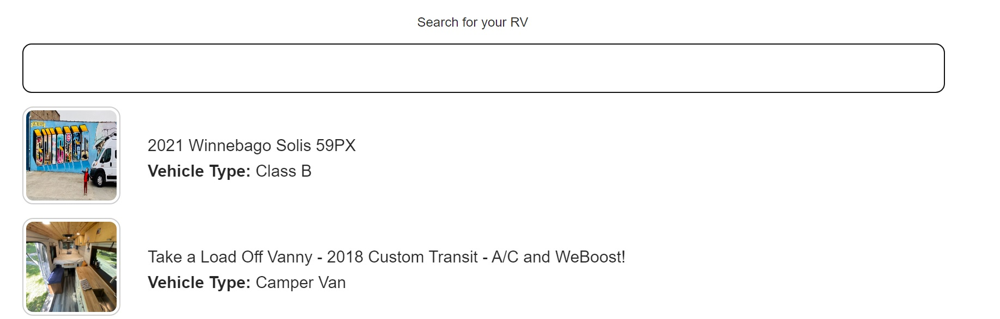

## Getting Started with Outdoorsy search feature

## What the project does
- This project is a single-page application (SPA) that uses API Key. You will be able to do a dynamic search by class/type of RV or/and name of RV.

## Search by class/type

## Search by name

## Preview primary image

## What's included
  The project is wrote on Visual Studio Code and using:
- Javascript;
- HTML;
- CSS;
- ESLint;
- GIT;
- ECMAScript features;

## Authors 
- [Nikola Stanilov](https://gitlab.com/nikolastanilov)

